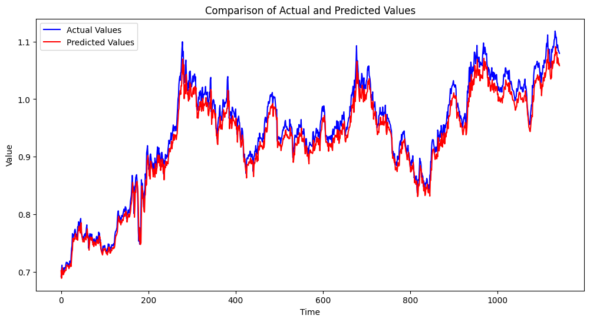

# ID2223Project

## Description

This repository is a course final project for ID2223 Scalable ML and DL in KTH. And here is the motivation of this project:

How to manage the cash liquidity is always an important issue for modern human beings. Therefore, we developed one program to predict the profit under specific allocation chosen by the users after a certain period of time. We provided three investment strategies which are Gold, NASDAQ Composite Index, and Bitcoin. We use the LSTM algorithm to make predictions about the price of bank interest rates, gold, S&P 500 (stock market), and BTC (Encrypted currency). The user can input their investment today and get the prediction about their profit or loss in 3 or 6 months (after the inflation index).

To meet the requirement of the course project, we need to:

- Manage dynamic data sources
- Train models and make predictions
- Deploy pipelines to build a scalable system

## Technologies

**yfinance**: Crawl Yahoo Finance data to generate data sets

**LSTM**: Train and predict on time series data

**Hopsworks**: Manage and store features and models

**Modal**: Periodically execute the program to update remote features and models

**Gradio**: Display prediction results

**Huggingface**: Deploy Gradio apps online

## Structure

First, we use yfinance to implement a tool for crawling Yahoo Finance historical data. We create DataFrames from historical data and create feature groups on Hopsworks through ***backfill-feature-group***.

Second, we retrieve historical features from Hopsworks and train the first-generation models using LSTM and upload the models to Hopsworks file system through ***training-pipeline***. Here is the gold example of our model, this picture shows that the predictions is relatively accurate.

Then we deploy ***feature-pipeline-daily*** on Modal to update the latest data to Hopsworks every working day. We also realize that, if there is a sufficient amount of new daily data, to avoid Concept Drift, it is necessary to retrain the model. That's why we have ***cyclical-training-pipeline*** to generate and update new models every month.

Finally, we infer and display prediction results by using Gradio app deployed on Hugging Face.

## How to Run

1. Clone this repo
2. Configure the Canda virtual environment and install requirements
3. Create accounts on hopsworks.ai and modal.com, create/cofigure necessary API keys and tokens
4. Run all *backfill-feature-group.ipynb*, *training-pipeline.ipynb*, *feature-pipeline-daily.py* and *cyclical-training-pipeline*.py in order
5. Run *investment_ui.py* in folder Gradio to see what will happen =）

## Gradio app

[Investment Predictor System](https://huggingface.co/spaces/Wenjian12581/investment_predictor)

## Contributors

The contributors of this repo are Tianyu Deng and Wenjian Ma.